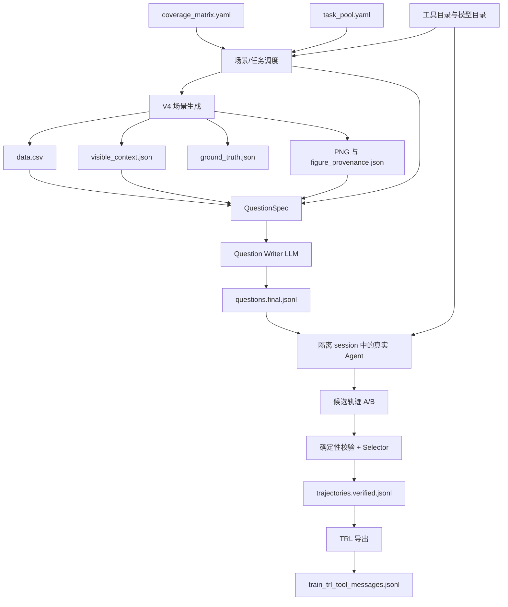

# SFT 数据构造逻辑

本文说明本项目当前主流程如何构造时序分析 VLM/Agent 的 SFT 数据。主流程位于
`api_sft/`，采用 **合成场景 + 自然语言问题 + 真实工具调用轨迹** 的方式生成训练样本。

项目中的 `sft/` 目录还保留了早期的静态问答数据和训练脚本；它们主要用于历史基线或
专项实验，不是当前 `api_sft` 主流程的替代品。

## 1. 一句话概括

一条最终 SFT 样本的构造关系是：

```text
覆盖矩阵/任务池
    → 场景模板与随机种子
    → 可见时序数据 + 隐藏真值 + 诊断图片
    → QuestionSpec
    → LLM 生成自然业务问题
    → Agent 在隔离 session 中真实调用工具
    → 轨迹校验与候选竞争
    → TRL conversational messages/tool SFT JSONL
```

最终训练样本不是“把生成器真值直接改写成答案”，而是记录模型看到的
`system/user` 输入、真实工具定义、工具调用、工具结果以及最终回答。

## 2. 设计目标

当前数据集希望训练模型同时具备以下能力：

1. 读取单序列和多序列时序数据，完成数据画像、相似性分析、模型结果分析、模型选择和工具使用。
2. 根据证据选择最小充分的工具链，而不是机械调用所有工具。
3. 区分结构化摘要、图像观察和统计检验能够支持的结论。
4. 处理缺失、异常、变点、季节性、协变量、数据泄漏、漂移、层级和业务成本等现实约束。
5. 生成可复现、可审计、没有隐藏真值泄漏的多模态 Agent 轨迹。

问题设计上避免只有一个结论的问题，例如“有没有趋势”或“哪个点异常”。一个合格问题通常至少包含两个决策点，并要求模型结合证据、工具结果和业务约束给出行动建议。

## 3. 主要配置与源文件

| 文件 | 作用 |
| --- | --- |
| `api_sft/config.example.yaml` | 随机种子、场景数量、复杂度、模态采样、模型和轨迹参数 |
| `api_sft/coverage_matrix.yaml` | 一级任务、样本比例、模态和覆盖目标 |
| `api_sft/task_pool.yaml` | 58 个细粒度任务及其工具偏好、必答要素和图片策略 |
| `api_sft/scenarios.py` | V4 场景、CSV、可见摘要、图片和隐藏真值生成 |
| `api_sft/signal_generator.py` | 趋势、季节、噪声等基础信号组件 |
| `api_sft/multiseries.py` | 多序列公共因子、组因子、个体因子和相关性质量门槛 |
| `api_sft/questions.py` | QuestionSpec、模态配对、问题生成和问题校验 |
| `api_sft/trajectories_compact.py` | 真实工具调用轨迹、双候选竞争和 compact 记录 |
| `api_sft/trajectory_verify_compact.py` | 轨迹结构、工具证据和防泄漏校验 |
| `api_sft/trajectory_exporters_compact.py` | 生成检查副本和 TRL 训练 JSONL |
| `api_sft/QUESTION_CONSTRUCTION.md` | Question 构造的详细设计说明 |
| `api_sft/TRAJECTORY_COMPACT_SCHEMA.md` | compact 轨迹字段协议 |

默认配置的重要参数如下：

```yaml
seed: 20260712
scenario_count: 200

scenario_generation:
  version: v4
  complexity_mix:
    controlled: 0.20
    compositional: 0.60
    confounded: 0.20
  oracle_free_images: true

trajectory_generation:
  min_tool_calls: 1
  max_tool_calls: 8
```

## 4. 总体数据流



## 5. 第一步：确定覆盖目标

### 5.1 一级任务

覆盖矩阵默认包含 5 类一级任务：

| 一级任务 | 默认比例 | 训练能力 |
| --- | ---: | --- |
| `data_profile` | 25% | 字段、频率、缺失、趋势、周期、异常和数据质量画像 |
| `similarity_analysis` | 18% | 相关性、标准化、DTW、滞后关系、聚类和局部 motif |
| `model_result_analysis` | 20% | 残差、校准、训练曲线、误差分组和线上漂移 |
| `model_selection` | 22% | 根据历史长度、序列关系、协变量、预测目标和成本选方案 |
| `tool_use` | 15% | 工具选择、调用顺序、最小充分链和错误工具的识别 |

### 5.2 细粒度任务

`task_pool.yaml` 目前定义 58 个细粒度任务。每个任务至少包含：

```yaml
- id: profile_seasonality_variants
  parent_task: data_profile
  title: 单周期、多周期与时变季节性
  instruction: 任务具体要模型完成的分析
  preferred_tools: [compute_acf, detect_periodicity, seasonality_detector, FFT, STL, plot]
  image_policy: high
  required_elements: [候选周期, 多周期判断, 时变性, 交叉验证, 建模影响]
```

`preferred_tools` 是任务的能力标签和质量检查依据，不是答案必须完整调用的工具清单。最终 Agent 是否调用某个工具，要由问题中的证据缺口和真实数据决定。

### 5.3 工具和模型目录

`prepare-catalogs` 从当前工具源码冻结工具目录，记录工具名、描述、参数 schema、源码位置和 hash。模型目录来自 `agent_tools/metadata_*.json`，用于模型检索和轨迹验证。

Question Writer 不直接看到完整的内部路由规则，也不被预先告知具体候选模型。需要模型选型时，Agent 必须在轨迹中真实执行 `model_catalog_search`，具体模型名只能来自本轮工具结果。

## 6. 第二步：生成 V4 合成时序场景

### 6.1 场景实例和场景模板

当前有约 29 个场景原型，例如趋势/周期画像、缺失、多周期、尺度组、相位组、motif、异常序列、残差、训练动态、线上漂移、协变量、层级和泄漏场景。

需要区分两个概念：

- **场景模板**：一种生成配方，例如 `phase_groups`。
- **场景实例**：模板在一个确定 seed 下生成的一套 CSV、图片、摘要、真值和 manifest。

默认 `scenario_count: 200` 表示生成 200 个实例，不表示只有 200 种模板。

### 6.2 复杂度混合

每个场景会分配一个复杂度等级，默认比例为：

| 等级 | 比例 | 作用 |
| --- | ---: | --- |
| `controlled` | 20% | 单一且可解释的模式，用于基础能力校准 |
| `compositional` | 60% | 趋势、季节、噪声、协变量和事件组合 |
| `confounded` | 20% | 视觉和统计证据可能冲突，或多个机制产生相似表象 |

复杂度序列由固定 seed 确定性生成。同一配置、代码版本和 seed 可以复现相同的复杂度分配与场景结果。

### 6.3 基础信号构造

普通时序可以抽象为：

\[
y_t = g(t) + \sum_k A_k(t)s_k(\phi_k(t)) + \beta(t)^T x_t + \epsilon_t
\]

实际启用哪些项由场景模板和复杂度决定：

- 趋势：无趋势、线性、二次、饱和、分段、局部反转或随机游走。
- 季节性：0–3 个周期，支持正弦、三角波、软方波、幅度调制、周期漂移和结构突变。
- 协变量：已知未来、未知未来、滞后作用、非线性作用和预测泄漏字段。
- 噪声：Gaussian、Student-t、AR(1)、局部异方差、水平相关和混合异常噪声。
- 事件：点异常、异常簇、上下文异常、均值变点、方差变点、慢漂移和缺失。

普通单序列的最终观测值可近似写为：

```text
clean = level + trend + seasonality
noise = noise_model(clean)
observed = offset + scale × (clean + noise × idiosyncratic_scale)
```

长度和序列数按模板采样：

- `short`：48–120 个时间点。
- `long`：720–1100 个时间点。
- `single`：1 条序列。
- `multiple`：5–8 条序列。

### 6.4 多序列构造

多序列不是简单复制同一条曲线，而是由公共、组级和个体因子共同生成：

\[
y_{i,t}=\mu_i+\sigma_i\left(\sqrt{w_c}f_t+\sqrt{w_g}g_{group(i),t}+\sqrt{w_i}u_{i,t}\right)
\]

其中：

- `f_t`：全局公共因子。
- `g_group(i),t`：组级因子。
- `u_i,t`：序列独有的趋势、周期和噪声。
- `μ_i`、`σ_i`：每条序列的偏移和尺度。

不同模板再施加特定关系：

| pattern | 主要关系 |
| --- | --- |
| `scaled_groups` | 形状相近但尺度、偏移或方差不同 |
| `phase_groups` | 相位错位，零滞后相关较弱但对齐后相似 |
| `heterogeneous_panel` | 每条序列机制不同，困难样本可出现局部反转 |
| `distribution_mismatch` | 分布相似但时间顺序被破坏 |
| `sequence_anomaly` | 一条序列含额外异常/频率，形成负迁移组 |
| `motif` | 不同序列在局部窗口出现相似波形 |

每个多序列候选会计算 pairwise Pearson、差分相关、去趋势相关、组内/组间相关、滞后相关和共同有效样本数。若不满足该模板的相关性目标，程序最多按配置确定性重采样 12 次；仍不满足则拒绝场景。

### 6.5 数据质量和专项机制

场景可以包含以下受控问题：

- 重复时间戳、时间间隔缺口、乱序。
- 随机缺失、连续缺失块、同步缺失和非随机缺失。
- 点异常、异常簇、上下文异常、均值变点和方差漂移。
- 间歇性需求、零膨胀和长尾分布。
- 已知/未知未来协变量、目标泄漏字段和层级结构。
- 训练/验证 loss 曲线中的过拟合、欠拟合和震荡。
- 残差周期、自相关、异方差、尾部误差和区间覆盖问题。
- 误差、特征 PSI、缺失率变化导致的概念/数据/流水线漂移。

### 6.6 场景输出

每个场景实例通常对应如下目录：

```text
scenario_xxxxx/
├── data.csv
├── visible_context.json
├── ground_truth.json
├── manifest.json
├── figure_provenance.json
└── figures/
```

其中：

- `data.csv`：模型和工具可访问的观测数据。
- `visible_context.json`：场景侧观测摘要和业务约束；完整内容只用于内部 QuestionSpec，不直接提供给 Question Writer。
- `ground_truth.json`：真实趋势、周期、异常位置、缺失机制、漂移原因等隐藏真值。
- `manifest.json`：场景模板、任务目标、模态、hash、布局和文件完整性信息。
- `figure_provenance.json`：每张图片的输入列、方法、参数和生成来源。

## 7. 第三步：控制真值和视觉泄漏

这是当前构造逻辑的核心约束。

### 7.1 可见信息

Question Writer 只能使用不会替模型完成数据分析的信息：

- 用户目标，以及标记为“结果未知”的待调查主题。
- 延迟、算力、解释性、错误代价、验证和人工复核等外部约束。
- 文件是否提供实际值、预测值、残差、区间、训练/验证指标等资源语义角色。
- 对应任务下无法从数据本身推断的预测范围、未来协变量可用性、层级、检测粒度、部署状态或使用方式。

行数、序列数、历史长短、精确列名、时间范围、缺失率、统计摘要和图片内容均不提供给 Writer。缺失、趋势、周期、异常、变点、相关性及其他可由工具发现的属性必须留给最终模型判断。

### 7.2 隐藏信息

以下信息只供校验或审计，不进入用户问题和训练答案提示：

- 生成器使用的真实趋势类型和参数。
- 注入的真实周期、变点位置、异常位置和 motif 起点。
- 缺失是随机、条件性还是同步缺失。
- 异常序列、公共/组/个体因子和序列变换。
- 漂移的真实原因和场景内部标签。

`scenario_hash` 和 `component_hash` 只用于完整性校验，不是对真值的可读编码。

### 7.3 图片必须是 oracle-free

普通诊断图片只读取观测数据，不读取 `ground_truth.json`。例如：

- 周期候选来自观测序列的诊断算法，而不是生成器真实周期。
- 异常候选来自滚动统计或 robust z-score，而不是注入位置。
- 变点候选来自观测窗口差异，而不是真实变点。

每张图的 provenance 必须记录 `oracle_truth_used: false`。因此图片候选与隐藏真值不完全一致是允许的，模型需要学会把视觉线索当作候选证据，并在必要时用统计工具确认。

## 8. 第四步：场景与任务匹配

Question 不是任意场景和任务的随机拼接。调度器优先使用语义兼容的场景：

| 任务类型 | 优先场景 |
| --- | --- |
| 缺失分析 | `missing_blocks` |
| 间歇性/长尾 | `intermittent` |
| DTW/领先滞后 | `phase_groups` |
| 分布相似但动态不同 | `distribution_mismatch` |
| motif | `motif` |
| 残差诊断 | `residual_period`、`residual_hetero` |
| 训练动态 | `overfit`、`underfit` |
| 漂移与重训练 | `drift` |
| 协变量/层级/概率预测 | 对应专项场景 |

调度顺序：

1. 按一级任务分组场景和细粒度任务。
2. 为每个细粒度任务优先占用兼容且尚未使用的场景。
3. 剩余场景在兼容任务之间循环分配。
4. 生成 `coverage_report.json`，检查任务、模态、序列规模、历史长度和工具覆盖。

如果用 `--limit` 只生成小样本，通常只能做流程调试，不能期待 58 个细粒度任务全部覆盖。

## 9. 第五步：模态采样和配对

图片价值和分析难度是两个独立维度。根据 `image_value` 进行分层模态采样：

| 图片价值 | text-only | image-text | paired |
| --- | ---: | ---: | ---: |
| low | 75% | 10% | 15% |
| medium | 30% | 30% | 40% |
| high | 10% | 75% | 15% |

三种情况含义如下：

- `text_only`：运行时只提供自然业务请求和暂存后的数据 URI。
- `image_text`：在相同业务请求和数据 URI 之外附加真实图片附件。
- `paired`：同一场景和同一细粒度任务生成一条 text-only 和一条 image-text 样本。

配对样本通过 `pair_id`、`pair_role` 和 `split_group` 绑定。训练/验证/测试划分时必须按 `split_group` 整组划分，不能让同一场景的两种模态进入不同 split，否则会产生跨模态泄漏。

## 10. 第六步：构造 QuestionSpec

`generate-question-specs` 不调用 Question Writer API。它把确定性信息整理为一份中间规范，主要包含：

- `task`、`subtask_id`、`task_goal`。
- `scenario_id`、`data_path`、`image_inventory`。
- `input_mode`、`image_value`、`difficulty`。
- `evidence_packet`：可见结构化证据和业务约束。
- `candidate_tools`：本题可以提供给 Agent 的真实工具集合。
- `primary_tools`：内部质量检查使用的重点工具，不直接展示给用户。
- `required_answer_elements`：必答内容。
- `model_catalog_scope`：是否允许进入预测/异常检测模型目录范围。
- `internal_rubric`：问题决策点、证据边界、工具提及限制等。
- `system_prompt`：统一的工具执行约束。

QuestionSpec 的作用是把“任务覆盖和数据证据”固定下来，再让 LLM 负责自然语言表达；这样可以避免让 LLM 自由编造场景、任务和真值。

## 11. 第七步：生成和校验自然语言问题

`generate-questions` 使用 Question Writer 根据 QuestionSpec 写出自然业务问题。

### 11.1 生成约束

问题应当：

- 描述自然的业务目标，而不是复述内部任务 ID。
- 至少包含两个决策点，通常还包含一个现实约束。
- 只引用外部业务条件与资源语义，不向 Writer 提供数据统计或观测结论。
- 不预先告诉模型固定工具链、答案章节或标准推理顺序。
- 不提前写出目录中的具体模型名。
- 不把隐藏真值当作事实描述。
- final 保留数据资源路径，轨迹运行时将其暂存并只向 Agent 展示 session URI。

`questions.final.jsonl` 只包含紧凑运行字段；事实路径、决策点、生成尝试和质量检查写入 `questions.audit.jsonl`。

### 11.2 问题校验

问题会进行确定性检查，典型拒绝项包括：

- 决策点数量不足。
- 引入外部业务条件之外的数字，或提前陈述缺失、趋势、周期、异常等数据结论。
- 直接使用隐藏真值提示。
- 擅自点名未允许的工具。
- 在不允许模型选型的题目中请求新的具体模型。
- 直接套用答案蓝图，例如预设“先做 A、再做 B、最后选 C”。
- 图片题没有正确附带图片，或纯文本题错误依赖图片。

通过的问题写入 `api_sft/output/questions.final.jsonl`；不通过的问题写入 `questions.rejected.jsonl`，必要时进入重写流程。

## 12. 第八步：真实 Agent 工具轨迹

这是当前 SFT 与早期静态问答数据的主要区别。

### 12.1 隔离 session

每道题会在独立工作空间中准备 `uploads/dataset.csv`。轨迹生成器不会预先创建分析 channel，也不会把标准工具调用顺序写进问题。

模型需要根据问题真实调用工具，例如：

```text
data_profile
    → data_convert(target_columns=[...])
    → compute_acf / adf_test / seasonality_detector / plot / DTW 等
    → 汇总证据
    → 最终回答
```

是否需要 `data_convert` 取决于模型对数据画像和工具 schema 的判断；工具调用失败的结果也会真实回填，模型可以修正参数后重试。

### 12.2 调用约束

- 每条轨迹至少成功调用 1 个工具。
- 最多调用 8 次工具。
- 第 7 次调用后提示只剩 1 次，第 8 次后强制进入最终回答。
- 相同错误参数连续失败两次才终止该候选。
- 工具结果限制最大字符数，避免把无界运行时内容写入训练集。
- 轨迹必须有完整的 `system → user → assistant/tool 循环 → final assistant` 结构。

### 12.3 双候选竞争

每个问题由两个支持 tool calls 的候选模型在独立 session 中生成轨迹：

1. 两个候选并行执行真实工具调用。
2. 先进行确定性硬校验，淘汰格式非法、工具证据缺失或发生泄漏的轨迹。
3. 两条都通过时，由 Selector 比较工具选择、证据充分性、最终回答和任务相关性。
4. 只有胜出候选进入 verified 轨迹和训练导出。

竞争审计单独保存候选的工具时间线、最终回答、评分、失败重试和选择理由，便于人工检查，但不把这些审计字段塞进训练消息。

## 13. 第九步：轨迹校验

`verify-trajectories` 对 raw 轨迹执行确定性检查。重点包括：

### 13.1 结构检查

- 首条消息是 system，第二条消息是 user。
- 工具调用和工具结果能按 call ID 对齐。
- 工具参数符合本题实际 schema。
- 轨迹最终以没有 `tool_calls` 的 assistant 回答结束。
- 成功工具计数和精简审计计数一致。

### 13.2 证据检查

- 最终结论能追溯到用户问题、工具结果或可见图片。
- 失败工具调用不能被当作成功证据。
- 目录模型名称只能来自 `model_catalog_search` 返回结果。
- 图片观察不能被伪装成统计显著性结论。
- 未验证的候选周期、异常或变点不能直接写成确定事实。

### 13.3 防泄漏检查

以下字段不能进入训练消息：

```text
truth_path
ground_truth
anomaly_indices
hidden_truth_for_verification_only
prepared_channels
primary_tools
model_route
matched_subclass
routing_rule
```

校验通过的记录写入 `trajectories.verified.jsonl`，失败记录写入 `trajectories.rejected.jsonl`。

## 14. 第十步：导出为训练数据

当前 compact 轨迹导出有两个主要文件：

| 文件 | 用途 |
| --- | --- |
| `api_sft/output/trajectory_exports/trajectories.compact.jsonl` | 人工检查、审计和复现 |
| `api_sft/output/trajectory_exports/train_trl_tool_messages.jsonl` | TRL conversational tool SFT |

训练记录的核心结构如下：

```json
{
  "messages": [
    {"role": "system", "content": "..."},
    {"role": "user", "content": "..."},
    {"role": "assistant", "tool_calls": [{"type": "function", "function": {"name": "data_profile", "arguments": {}}}]},
    {"role": "tool", "name": "data_profile", "content": "..."},
    {"role": "assistant", "content": "最终回答"}
  ],
  "tools": [{"type": "function", "function": {"name": "data_profile", "parameters": {}}}],
  "images": ["...png"]
}
```

注意：

- 工具参数在 TRL 数据中是 Python/JSON object，不是 OpenAI wire format 中的 JSON 字符串。
- 工具结果使用 `role=tool`、`name` 和字符串 `content`。
- 初始图片和工具生成图片按 VLM chat template 需要转换成 image/text content blocks。
- 训练不使用 `final_answer`、`metrics`、`verification` 等审计便捷字段，而使用 `messages` 中的完整对话。
- compact writer 使用严格 JSON；`NaN`、`Infinity` 和 `-Infinity` 会转换为 `null`。

## 15. 产物目录

默认输出位于 `api_sft/output/`：

```text
api_sft/output/
├── catalogs/
│   ├── data_analysis_tools_bundle.json
│   ├── tools.normalized.json
│   └── models.normalized.json
├── scenarios/
│   └── scenarios.jsonl
├── question_specs.jsonl
├── questions.final.jsonl
├── questions.audit.jsonl
├── questions.rejected.jsonl
├── coverage_report.json
├── trajectories.raw.jsonl
├── trajectories.competition_audit.jsonl
├── trajectories.verified.jsonl
├── trajectories.rejected.jsonl
└── trajectory_exports/
    ├── trajectories.compact.jsonl
    ├── train_trl_tool_messages.jsonl
    └── trajectory_run_summary.json
```

各文件的职责：

- `scenarios.jsonl`：场景 manifest 清单，记录 CSV、图片、真值路径和 hash。
- `question_specs.jsonl`：确定性问题规范，不是最终训练问题。
- `questions.final.jsonl`：自然请求、资源、任务边界和工具白名单组成的紧凑运行记录。
- `questions.audit.jsonl`：问题生成与质量审计，不进入轨迹模型输入。
- `coverage_report.json`：任务、模态、场景规模、难度和工具覆盖结果。
- `trajectories.raw.jsonl`：候选竞争后的原始胜出轨迹记录。
- `trajectories.competition_audit.jsonl`：候选 A/B 的比较审计。
- `trajectories.verified.jsonl`：通过确定性校验、可用于导出的轨迹。
- `train_trl_tool_messages.jsonl`：最终训练输入。

## 16. 推荐运行顺序

安装依赖并准备配置：

```bash
python -m pip install -r api_sft/requirements.txt
cp api_sft/config.example.yaml api_sft/config.yaml
```

准备工具和模型目录：

```bash
python -m api_sft --config api_sft/config.yaml prepare-catalogs
```

生成场景、QuestionSpec 和问题：

```bash
python -m api_sft --config api_sft/config.yaml generate-scenarios --resume
python -m api_sft --config api_sft/config.yaml generate-question-specs --resume
python -m api_sft --config api_sft/config.yaml generate-questions --resume
```

也可以执行：

```bash
python -m api_sft --config api_sft/config.yaml run-all --resume
```

生成真实工具轨迹。首次使用 compact 轨迹格式，或格式发生变化后，使用 `--fresh`；同一格式的中断任务才使用 `--resume`：

```bash
python -m api_sft --config api_sft/config.yaml generate-trajectories --fresh
python -m api_sft --config api_sft/config.yaml verify-trajectories --resume
python -m api_sft --config api_sft/config.yaml export-trajectories
```

最后运行本地测试：

```bash
python -m unittest discover -s api_sft/tests -v
```

## 17. 可复现性和断点续跑

可复现性来自以下信息的共同固定：

- 全局 seed。
- 场景编号和生成 attempt seed。
- 复杂度分配和场景模板调度。
- 工具源码、模型目录和组件 hash。
- CSV、图片、真值、manifest 的文件 hash。

`--resume` 只复用格式正确、质量门槛通过、文件 hash 有效且 `component_hash` 一致的记录。轨迹格式变化时，旧记录会进入 `trajectory_run_archives/<timestamp>/`，不能和新 compact 格式混合续跑。

## 18. 质量检查清单

生成一批数据后，至少检查：

1. `coverage_report.json` 的 `passed` 是否为 `true`。
2. 5 个一级任务和目标模态是否都有覆盖。
3. 58 个细粒度任务是否达到预期覆盖，是否存在场景不足造成的缺口。
4. `figure_provenance.json` 是否全部为 `oracle_truth_used: false`。
5. `ground_truth.json` 路径、真实异常位置和生成器参数是否没有进入 messages。
6. 配对样本是否按 `split_group` 整组划分。
7. 轨迹是否至少有一次成功工具调用，且最终回答有工具证据。
8. 工具调用参数是否符合真实 schema，工具结果是否可读。
9. 训练导出是否能被标准 JSONL 解析，图片路径是否存在。
10. 模型 chat template 是否同时支持 tool calls 和 image content blocks。

## 19. 与旧版静态 SFT 数据的关系

`open_data/` 和 `sft/` 中的 `TimeSeriesExam1`、`train_cot.jsonl` 等数据主要是静态问答或 CoT 训练格式，常见特点是：

- 问题直接携带时序数组或固定字段。
- 答案通常是预先生成的文本或思维链。
- 不一定包含真实工具调用、工具结果和工具 schema。
- 不具备当前 `api_sft` 的 QuestionSpec、场景 hash、oracle-free 图片和候选轨迹竞争机制。

它们可以用于基线、格式转换或专项实验；如果目标是训练当前的时序工具 Agent/VLM，应优先使用 `api_sft/output/trajectory_exports/train_trl_tool_messages.jsonl`。

## 20. 与 DPO 的关系

`api_dpo/` 是独立的偏好数据构造流程，不属于 SFT 样本生成本身。通常的关系是：

```text
api_sft 生成高质量工具轨迹
    → 可选地构造回答/轨迹偏好对
    → api_dpo 生成 DPO 数据
```

因此，SFT 阶段关注“模型如何完成任务并产生可训练轨迹”，DPO 阶段关注“两个候选回答或轨迹哪个更好”。
