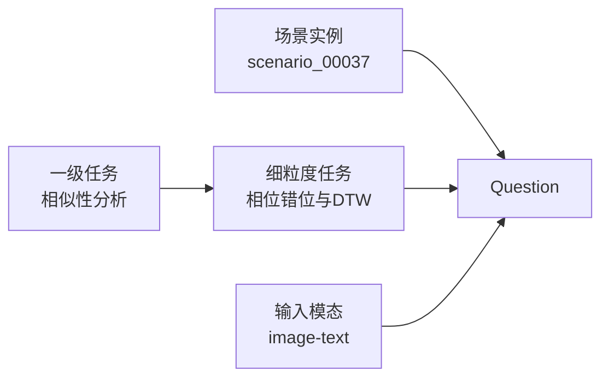
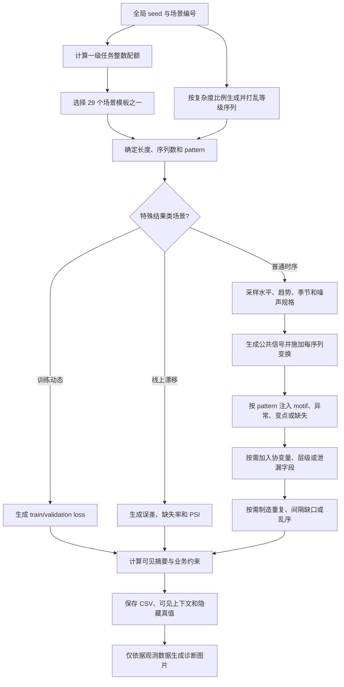
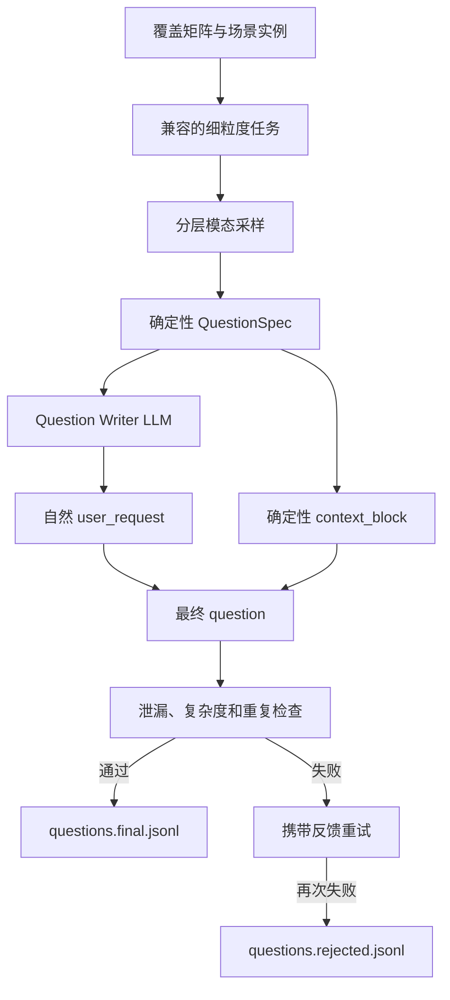

# 多模态时序 SFT Question 构造流程

本文说明 `api_sft` 如何从覆盖矩阵、细粒度任务池、合成时序场景、真实工具目录和模型目录构造高难度 Question。当前版本采用“确定性 QuestionSpec + LLM 直接写题”，生成 `text_only` 与 `image_text` 两类问题；Answer 阶段再由独立轨迹生成器执行真实工具闭环。

## 0. 统一术语与关系

本文统一使用以下术语：

| 术语 | 定义 | 当前数量 | 记录字段 |
| --- | --- | ---: | --- |
| 一级任务 | 模型需要掌握的主要能力类别 | 5 | `task` |
| 细粒度任务 | 一级任务下的一种具体问题类型；与“子任务”含义相同，本文不再另设子任务层级 | 58 | `subtask_id` |
| 场景模板 | 合成数据的生成机制或配方 | 29 | `archetype` / `pattern` |
| 场景实例 | 场景模板使用一次具体随机种子生成的 CSV、可见摘要、图片和隐藏真值 | 默认 200 | `scenario_id` |
| Question | 场景实例、细粒度任务和输入模态绑定后形成的训练问题 | 由模态采样决定 | `id` |

其中，`scenario_count: 200` 指生成 200 个场景实例，不是定义 200 种场景模板。29 个场景模板可以通过不同随机种子反复生成长度、序列数量、周期、噪声和业务约束不同的场景实例。

一个具体 Question 的关系如下：



可以简写为：

```text
场景实例 + 细粒度任务 + 输入模态 = Question
```

当前实现中，每个场景实例只分配一个细粒度任务；模态采样为 `paired` 时，使用相同的场景实例和细粒度任务分别生成一条 `text_only` 与一条 `image_text` Question。

## 1. 设计目标

Question 数据需要训练 VLM 同时掌握：

1. 时序数据画像、相似性、模型结果分析和模型选择。
2. 33 个 TSA 工具的选择条件、拒绝条件、输入依赖和调用顺序。
3. 什么时候结构化文本已经足够，什么时候画图能显著提高效率。
4. 哪些视觉结论仍需统计检验确认。
5. 单/多序列、长/短历史以及预测、异常检测、诊断和监控任务的差异。
6. 验证、时序泄漏、业务代价、解释性和计算成本。

Question 不能是“有没有趋势”“哪个点异常”“推荐哪个模型”等单结论问题。

## 2. 输入配置

### 2.1 覆盖矩阵

文件：`coverage_matrix.yaml`

定义：

- 五个一级任务及目标比例。
- 单/多序列、长/短序列。
- 任务目标。
- 输入模态和推荐分析模式。
- 图像价值与难度。
- 默认要求每个一级任务整体包含 text-only 和 image-text；是否强制每个细粒度任务双模态由配置开关控制。
- 任务池中 33 个工具必须全部覆盖。

默认一级任务比例：

| 一级任务 | 比例 | 默认 200 个场景实例 |
| --- | ---: | ---: |
| 数据画像 | 25% | 50 |
| 相似性分析 | 18% | 36 |
| 模型结果分析 | 20% | 40 |
| 模型选择 | 22% | 44 |
| 工具使用 | 15% | 30 |

场景配额采用最大余数法，使整数配额之和严格等于 `scenario_count`。

### 2.2 细粒度任务池

文件：`task_pool.yaml`

共 58 个细粒度任务：

| 一级任务 | 细粒度任务数 |
| --- | ---: |
| 数据画像 | 10 |
| 相似性分析 | 11 |
| 模型结果分析 | 12 |
| 模型选择 | 13 |
| 工具使用 | 12 |

每个任务条目包含：

```yaml
- id: profile_seasonality_variants
  parent_task: data_profile
  title: 单周期、多周期与时变季节性
  instruction: 该题具体要求模型完成什么分析
  preferred_tools:
    - compute_acf
    - detect_periodicity
    - seasonality_detector
    - FFT
    - STL
    - plot
  image_policy: high
  required_elements:
    - 候选周期
    - 多周期判断
    - 时变性
    - 交叉验证
    - 建模影响
```

`preferred_tools` 的并集覆盖 bundle 中全部 33 个工具。它表达该细粒度任务应重点学习的工具，不代表答案必须机械调用列表中的全部工具。

### 2.3 工具目录

来源：`data_analysis_tools_bundle.json`

`prepare-catalogs` 提取：

- 工具名与 MCP permission name。
- 类别和描述。
- schema 名。
- 从实现源码提取出的参数键。
- 源文件和实现 hash。

`preferred_tools` 与一级任务补充工具只进入 `QuestionSpec.internal_rubric` 和后续质检，不提供给 Question Writer。只有明确的工具边界题和 hard negative 可以通过 `allowed_user_tool_mentions` 允许用户问题点名特定工具。

### 2.4 模型目录

来源：`metadata_1.json`、`metadata_2.json`、`metadata_3.json`。

根据任务目标优先检索预测或异常检测模型，保留模型名称、模型包、运行时和支持任务。这些模型只作为后续路由和验证目录保存，Question Writer 看不到候选模型，用户问题也不得提前出现 Chronos 或其他具体候选名称。

## 3. 五类细粒度任务

### 3.1 数据画像（10）

1. 字段、频率与时间索引质量检查。
2. 线性、非线性与局部趋势。
3. 平稳性与差分需求。
4. 单周期、多周期与时变季节性。
5. 随机、连续与同步缺失。
6. 点异常、上下文异常与异常簇。
7. 均值变点、方差变点与缓慢漂移。
8. 间歇性、零膨胀与长尾分布。
9. 多序列尺度与方差异质性。
10. 文本画像是否充分与补图决策。

### 3.2 相似性分析（11）

1. 原始尺度下的趋势一致性。
2. 标准化后的形状相似性。
3. Pearson 与 Spearman 选择。
4. 相位错位与 DTW。
5. 滞后相关与领先滞后关系。
6. 分布相似但时序形状不同。
7. 形状相似但方差不同。
8. 序列聚类与代表序列选择。
9. 多序列中的异常序列识别。
10. 子序列 motif 与局部相似性。
11. 根据相似组选择全局或局部模型。

### 3.3 模型结果分析（12）

1. 残差均值偏离零。
2. 残差遗漏周期。
3. 残差自相关与白噪声检验。
4. 残差异方差。
5. 极端值与尾部误差。
6. 不同 horizon 的误差退化。
7. 不同序列与业务分组的误差差异。
8. 预测区间覆盖率与校准。
9. 过拟合、欠拟合与训练震荡。
10. 数据漂移与概念漂移区分。
11. 模型准确率、稳定性与成本权衡。
12. 重训练、回滚与人工复核规则。

### 3.4 模型选择（13）

1. 短历史与长历史。
2. 单序列与多序列 panel。
3. 单变量与多变量模型。
4. 已知与未知未来协变量。
5. 单周期与多周期模型选择。
6. 趋势、变点与非平稳模型选择。
7. 间歇性需求模型选择。
8. 概率预测与区间预测。
9. 点异常与序列异常检测模型。
10. 层级预测与 reconciliation。
11. 基础模型 zero-shot 与监督训练模型。
12. 高解释性、低延迟与低算力约束。
13. 全局、局部与分组模型。

### 3.5 工具使用（12）

1. 最小充分工具链。
2. 什么时候只用 `data_profile`。
3. 什么时候必须调用 `plot`。
4. ADF、FFT、ACF 与 STL 的顺序。
5. Pearson、Spearman 与 DTW 选择。
6. 缺失分析后是否插补。
7. 异常检测与变点检测顺序。
8. 先标准化还是先比较相似性。
9. 图像后是否仍需统计检验。
10. 统计摘要充分时避免画图。
11. 工具结果冲突时继续分析。
12. 错误工具与错误顺序 hard negative。

## 4. 场景生成

`generate-scenarios` 根据覆盖矩阵计算一级任务配额，再从该任务的场景原型中循环选择。当前生成器版本为 V4，单序列基本形式为：

\[
y_t=g(t)+\sum_k A_k(t)s_k(\phi_k(t))+\beta(t)^Tx_t+\epsilon_t
\]

其中各项不是固定全部启用，而是由场景模板和复杂度等级共同采样：

- 趋势 `g(t)`：无趋势、线性、二次、饱和、分段、局部反转或平滑随机游走。
- 季节项：0–3 个周期，可使用正弦、三角波或软方波，并支持幅度调制、周期漂移和季节结构突变。
- 协变量：已知未来、未知未来和泄漏变量，可具有线性、滞后或非线性作用。
- 噪声：高斯、Student-t、AR(1)、局部异方差、水平相关或混合异常噪声。
- 多序列关系：共享基础结构，同时加入尺度、偏移、相位和方差差异；指定模板还会产生异常序列、相似组和局部 motif。
- 数据质量与事件：随机/条件/连续/同步缺失、重复/乱序/间隔缺口、点异常、上下文异常、异常簇、均值/方差变点和缓慢漂移。

默认复杂度配额为：

| 等级 | 比例 | 用途 |
| --- | ---: | --- |
| `controlled` | 20% | 单一、可解释模式，用于基础能力和因果边界校准 |
| `compositional` | 60% | 多组件共同作用，贴近常见业务序列 |
| `confounded` | 20% | 视觉与统计证据可能冲突，或不同机制产生相似表象 |

配额使用固定 seed 确定性分配；默认 200 个场景恰好得到 40/120/40。同一 seed、配置和代码版本下，CSV、真值、图片和 hash 均可复现。

### 4.1 从 seed 到场景实例的生成顺序

一个场景实例不是一次性写出最终曲线，而是按以下顺序构造：



长度和序列数量的当前采样范围为：

| 模板标签 | 实际采样 |
| --- | --- |
| `short` | 每条序列 48–120 个时间点 |
| `long` | 每条序列 720–1100 个时间点 |
| `single` | 1 条序列 |
| `multiple` | 5–8 条序列 |

每个实例使用 `seed + scenario_index` 初始化独立随机数生成器。复杂度等级由全局 seed 加固定偏移后确定性打乱，因此增加某个场景内部的随机操作不会改变复杂度总配额。

### 4.2 基础信号组件

普通场景先采样一份隐藏 `signal_spec`，其中基础水平从 `[30, 80)` 采样。趋势的具体实现如下：

| 趋势类型 | 形式或主要参数 |
| --- | --- |
| `none` | 趋势项恒为 0 |
| `linear` | `slope × t`，斜率约在 `[-0.035, 0.055)` |
| `quadratic` | `slope × t + curvature × t²`，曲率约在 `[-8e-5, 8e-5)` |
| `saturating` | 双曲正切饱和趋势，随机采样幅度、中点和过渡宽度 |
| `piecewise` | 在历史 35%–70% 处切换斜率，前后斜率可异号 |
| `local_reversal` | 线性趋势叠加局部高斯形凸起或凹陷 |
| `random_walk` | 高斯增量累积后做 7–48 点平滑；增量 seed 单独保存在隐藏规格中 |

不同复杂度不会从同一个池均匀采样：

- `controlled`：有趋势时只使用线性趋势。
- `compositional`：在线性、二次、饱和和分段趋势中采样。
- `confounded`：使用二次、饱和、分段、局部反转或随机游走，使局部走势不一定代表全局趋势。

模板还会覆盖趋势池。例如 `stationary` 强制无趋势，`short_trend` 强制无季节项；`trend_period`、`phase_groups` 和 `scaled_groups` 强制含周期结构；`multi_period` 强制构造多个季节项。训练曲线和线上漂移模板不走普通信号公式，而使用独立结果生成器。

### 4.3 季节性与周期采样

周期候选不再固定为 `7/12/24`。程序从以下池中筛选不超过序列长度三分之一的候选：

```text
5, 7, 12, 18, 24, 30, 48, 72, 96, 120, 168, 240, 365
```

如果没有候选，则使用约 `n/4` 的回退周期。每个季节项还会采样：

- 振幅：首个周期约为 3–10，后续周期按 `1/sqrt(k)` 缩小，避免高阶周期完全主导。
- 波形：正弦、三角波或软方波；`controlled` 只使用正弦。
- 初始相位：在 `[0, 2π)` 内采样。
- 振幅调制：`compositional` 和 `confounded` 按不同概率启用，调制强度约为 0.15–0.55。
- 周期漂移：仅困难的 `confounded` 场景启用，基础周期沿时间缓慢收缩或扩张。
- 季节结构突变：可在历史 40%–72% 处把振幅乘以约 0.35–1.75。

`confounded` 场景的第二个及后续周期还会乘以约 0.92–1.09 的连续系数，因此可以出现非整数、互不整除且随时间变化的多周期。瞬时周期按下式变化：

\[
P_t=\max\left(2, P_0\left[1+d\left(\frac{t}{n-1}-0.5\right)\right]\right)
\]

相位不是简单使用固定 `2πt/P`，而是累加每个时刻的 `2π/P_t`，从而真正产生频率缓慢变化的序列。

### 4.4 噪声模型

噪声尺度首先从约 0.8–2.5 采样，然后根据复杂度选择噪声族：

| 噪声类型 | 生成方式 | 主要分析难点 |
| --- | --- | --- |
| Gaussian | 独立高斯创新 | 基础白噪声基线 |
| Student-t | 自由度约 3.2–7.5 的重尾创新，并做方差缩放 | 极端值不一定是注入异常 |
| AR(1) | `e_t = φe_(t-1) + u_t`，`φ` 约 0.35–0.88 | 残差自相关和伪趋势 |
| Heteroscedastic-ramp | 噪声尺度从约 0.65 逐渐增大到 2–5 倍 | 全局方差漂移 |
| Heteroscedastic-window | 历史局部窗口内放大约 2.5–5.5 倍 | 局部高波动容易与异常簇混淆 |
| Level-dependent | 噪声尺度随信号偏离中位数的程度变化 | 水平与方差相关 |
| Mixture | 小概率加入约 4–9 倍的大创新 | 混合异常噪声与点异常冲突 |

`controlled` 默认只使用 Gaussian；`compositional` 可使用 Gaussian、Student-t、AR(1) 或异方差；`confounded` 主要使用重尾、AR(1)、异方差、水平相关和混合噪声。

最终单序列的构造顺序为：

```text
clean = level + trend + seasonality
noise = noise_model(clean)
observed = offset + scale × (clean + noise × idiosyncratic_scale)
```

### 4.5 多序列关系与质量门槛

V4 不再让所有序列复制同一条趋势和季节曲线。多序列使用分层因子公式：

\[
y_{i,t}=\mu_i+\sigma_i\left(\sqrt{w_c}f_t+\sqrt{w_g}g_{group(i),t}+\sqrt{w_i}u_{i,t}\right)
\]

`f_t` 是全局公共因子，`g` 是实际参与生成的组因子，`u` 是每条序列独立采样的趋势、周期和噪声。权重和为 1；每条序列还拥有不同的尺度、偏移和振幅。隐藏真值保存目标相关层级、三个因子规格、载荷、实际统计指标和重采样次数。

普通画像、缺失、多周期、协变量、泄漏和残差 panel 按 25%/50%/25% 采样低、中、高相关，目标均值区间分别为 0.10–0.40、0.40–0.70 和 0.70–0.90。特殊模板使用独立规则：尺度组保持高形状相关；相位组要求零滞后相关较低而最佳滞后相关较高；motif 要求全局相关有限而局部窗口相关较高；层级模板要求组内相关至少比组间高 0.15；异常序列必须与正常组分离。

每个多序列候选生成后计算 pairwise-complete Pearson、一阶差分相关、线性去趋势相关、组内/组间相关和共同有效样本数。相位、分布、motif 和异常序列模板还计算任务专属指标。不满足目标时使用确定性子 seed 重采样，默认最多 12 次；仍失败则终止该场景而不是静默保存。

主要模板变换如下：

| pattern | 生成关系 |
| --- | --- |
| `scaled_groups` | 序列共享形状，但尺度随序列编号变化，个体噪声方差也分组变化 |
| `phase_groups` | 按三组加入不同相位偏移，制造零滞后相关较弱但 DTW/滞后对齐后相似的场景 |
| `heterogeneous_panel` | 每条序列独立采样尺度、偏移、相位和噪声强度；困难场景中的部分序列再加入局部趋势反转 |
| `distribution_mismatch` | 一条序列使用另一条序列的随机排列或乱序分块，保留近似分布但破坏动态顺序 |
| `sequence_anomaly` | 从 panel 中选择一条序列注入变点、异常和额外频率，形成负迁移组 |
| `motif` | 在不同序列的相近但不完全相同位置注入同一局部波形 |

这使“共享一个生成公式”不等于“所有序列完全相同”。模型需要判断标准化、滞后对齐、分组建模或异常序列隔离是否必要。

### 4.6 事件、缺失和专项结果场景

事件在基础信号生成后注入，具体位置和强度只保存到隐藏真值：

- 变点：通常位于历史 50%–70%，均值移动约 7–16；较复杂场景还会把变点后的局部方差放大约 1.35–2.4 倍。
- 点异常：通常在历史中间 12%–88% 区域选取两个位置，加入约 16–30 的正向或负向冲击。
- 异常簇：`compositional/confounded` 在局部连续区间注入较小但持续的偏移。
- 上下文异常：`confounded` 会修改一个原本处于局部高位的观测，使其从全局数值看不一定极端。
- motif：长度约 12–36，在每条序列的两个局部区间重复出现，并带少量扰动。
- 间歇性需求：事件发生概率约 7%–19%，非零值来自对数正态长尾分布；复杂场景中发生概率还随时间变化。

缺失机制包括：

- 连续缺失块：长度约占序列的 4.5%–10%。
- 随机缺失：复杂场景额外抽取约 1%–3.5% 的位置。
- 同步缺失：多序列困难场景让不同序列共享缺失块起点。
- 条件缺失：`confounded` 从较高取值区域中选择缺失位置，制造非随机缺失。

时间索引质量模板还会受控地产生重复时间戳、时间间隔缺口或行顺序打乱。泄漏模板加入 `target_t_plus_1` 和未来窗口目标均值；协变量模板加入已知未来促销、周期温度及预测时未知的配送延迟，其中促销带 1–3 步滞后作用，温度使用非线性作用。

模型结果类场景使用独立生成逻辑：

- 残差场景叠加遗漏周期、AR 残差、系统偏差、随时间增大的振幅、尾部放大和不足覆盖区间。
- 训练动态场景分别生成训练/验证曲线分叉、欠拟合平台和困难场景中的训练震荡。
- 线上漂移场景分别改变误差、特征 PSI 或缺失率，用来区分概念漂移、数据漂移、流水线漂移和组合漂移；困难场景只影响部分序列。

### 4.7 可见摘要与隐藏真值

生成结束后，程序才从最终观测表计算可见信息：列名、行数、序列数、每序列长度、频率标签、数值列均值/标准差/最小值/最大值/缺失率，以及随机采样的延迟、可解释性、算力、误差代价和时间有序验证约束。

以下内容只进入 `ground_truth.json`，不会进入 Question Writer 的证据包：真实趋势类型和参数、真实周期、异常与变点位置、缺失机制、漂移原因、异常序列、motif 位置、公共因子和每序列变换。`scenario_hash` 可以依赖这些信息，但它只是不可逆审计 hash，不暴露真值。

29 个原型覆盖：

- 趋势、周期、多周期、平稳序列。
- 随机或连续缺失、间歇性和长尾。
- 点异常、变点和异常序列。
- 尺度差异、相位错位、分布相似但动态不同、局部 motif。
- 残差周期、异方差、尾部误差、horizon、区间和多模型结果。
- 过拟合、欠拟合和线上漂移。
- 协变量、层级结构和概率预测需求。

每个场景实例输出：

```text
scenario_xxxxx/
├── data.csv
├── visible_context.json
├── ground_truth.json
├── manifest.json
├── figure_provenance.json
└── figures/
```

`ground_truth.json` 的 `generator` 字段保存 `version=v4`、复杂度等级、组件参数、因子结构、质量门槛结果和事件参数，同时保留 `base_period`、`trend_slope`、`change_point` 等兼容字段。`manifest.json` 还保存 `data_layout`、`wide_column_map`、文件 hash 和迁移来源。

### 4.8 难度与图片价值分离

V4 分别保存：

- `signal_complexity`：生成机制是 controlled、compositional 还是 confounded。
- `analysis_difficulty`：当前实例是否真正包含证据冲突、跨序列异质性或多个任务相关机制。
- `image_value`：图片相对结构化文本的信息增益。
- `task_difficulty`：细粒度任务本身的推理要求，由 `task_pool.yaml` 独立配置。

兼容字段 `difficulty` 等于 Question 的最终难度。只有 `analysis_difficulty=hard` 且 `task_difficulty=hard` 时，Question 才标记为 hard；图片价值高、历史较长或序列数量多都不能单独触发困难标签。

### 4.9 图片证据边界

`visible_context.json` 只含可从观测数据计算或业务侧明确给出的信息，可进入 Question；`ground_truth.json` 只能供最终 verifier 使用。普通图片生成函数不接收 `truth`：

- STL 的周期来自观测序列的去趋势 FFT 候选，而非真实周期。
- 异常候选来自滚动中位数与 robust z-score，而非注入位置。
- 变点候选来自观测窗口的均值差评分，而非真实变点。
- 每张图在 `figure_provenance.json` 中记录输入列、方法、诊断参数以及 `oracle_truth_used=false`。

因此，图片上的候选标注可以与隐藏真值不完全一致。这不是生成错误，而是用来训练模型区分“视觉/工具候选”和“已证实事实”，并在证据冲突时选择进一步验证。

标准化叠图只对已观测值计算均值和标准差，保留 NaN 断点。相关性热图使用 pairwise-complete 观测并记录每对序列的共同有效样本数。DTW 如果需要插值，会在 provenance 中明确标记，缺失画像题默认优先附带缺失热图而非插值后的 DTW 图。

### 4.10 从 V3 迁移

`migrate-scenarios` 将 V3 long panel 转为独立的 `scenarios`。主值列使用 `s01,s02,...`，其他指标使用双下划线后缀；重复 `(time,series_id)` 变成稀疏重复 time 行，不聚合。只有语义真值、重复数量、质量门、图片 provenance 和文件 hash 全部通过后，V4 聚合清单才可供 QuestionSpec 使用。

## 5. 细粒度任务与场景匹配

Question 生成器不是随机把任意细粒度任务贴到任意场景上，而是执行兼容性匹配。例如：

- 缺失任务优先匹配 `missing_blocks`。
- 间歇性任务匹配 `intermittent`。
- DTW 和领先滞后任务匹配 `phase_groups`。
- 分布相似但动态不同匹配 `distribution_mismatch`。
- motif 任务匹配 `motif`。
- 残差类任务匹配 `residual_period` 或 `residual_hetero`。
- 训练动态任务匹配 `overfit` 或 `underfit`。
- 漂移与重训练任务匹配 `drift`。
- 协变量、层级、概率区间任务分别匹配对应场景。

调度步骤：

1. 按一级任务分组场景和任务池条目。
2. 每个细粒度任务先占用一个兼容且尚未使用的场景。
3. 剩余场景在兼容细粒度任务间循环分配。
4. 场景不足时不进行错误匹配，覆盖报告会列出缺失的细粒度任务。

默认 200 个场景实例足以覆盖全部 58 个细粒度任务。较小 `--limit` 只适合局部调试，通常不会通过完整覆盖检查。

## 6. 分层模态采样

不再为每个“场景实例 × 细粒度任务”固定生成两个 Question。调度器根据图像价值选择单一模态或严格配对：

| 图像价值 | Text-only | Image-text | 严格配对 |
| --- | ---: | ---: | ---: |
| 低 | 75% | 10% | 15% |
| 中 | 30% | 30% | 40% |
| 高 | 10% | 75% | 15% |

比例在满足覆盖约束后按固定 seed 确定，因此相同配置可复现。`paired` 表示同一个场景生成一条 text-only 和一条 image-text；其他情况只生成一条 Question。

使用默认任务池、200 个场景实例和默认 seed 的调度模拟结果为：47 个 standalone text、106 个 standalone image、47 个 paired 场景实例，共生成 247 条 Question。相比固定配对的 400 条 Question，减少了 153 条近重复及其后续 API 调用。

默认约束：

- 每个细粒度任务至少进入数据集一次。
- 每个一级任务整体上同时存在 text-only 和 image-text。
- 不强制每个细粒度任务同时拥有两种模态，避免对照样本挤占主模态比例。
- 可将 `ensure_each_subtask_both_modalities` 设为 `true`，恢复严格的细粒度任务双模态覆盖；细粒度任务只有一个兼容场景实例时将强制配对。

严格配对记录包含：

```json
{
  "pair_id": "pair_scenario_00001_profile_seasonality_variants",
  "is_paired": true,
  "pair_role": "text_only",
  "split_group": "scenario_00001"
}
```

训练、验证和测试划分必须按 `split_group` 整组分配，禁止同一场景的两个模态落入不同数据划分。

### Text-only

- 只提供字段、规模、可见统计摘要和业务约束。
- 要求说明已有证据支持什么。
- 要求说明哪些判断当前不能做。
- 如果需要图像，只能推荐最小充分图像集合并解释信息增益。

### Image-text

- 提供相同文本上下文。
- 根据一级任务选择最多三张相关图。
- 要求引用真实可见的形状、相对变化、时间位置或序列关系。
- 要求指出哪些视觉判断仍需统计检验确认。

### 6.1 `image_policy` 的定义与产生方式

`image_policy` 是细粒度任务级的“图片价值先验”。它在构造 Question 之前由任务池预先定义，不是先生成问题文本，再由大模型或程序分析问题内容后动态计算。

例如：

```yaml
- id: tool_profile_only
  parent_task: tool_use
  title: 什么时候只用 data_profile
  image_policy: low
```

运行时的继承顺序是：

```text
task_pool.yaml 为细粒度任务预定义 image_policy
    -> 合成场景实例匹配细粒度任务
    -> Question 继承该细粒度任务的 image_policy
    -> 映射为 image_value 和 recommended_mode
    -> 根据对应等级的配置比例采样实际 input_mode
```

如果某个任务池条目没有填写 `image_policy`，代码默认将其视为 `conditional`。当前取值含义如下：

- `low`：字段、schema、规模、统计摘要、业务约束或工具前置条件通常已经足够，图像信息增益低。
- `conditional` / `medium`：文本可以完成初筛，但是否画图需要结合仍未解决的不确定性决定。
- `high`：时间位置、局部形态、跨序列关系、残差动态或训练动态难以由汇总统计充分表达，图像通常具有显著信息增益。

任务池的 `image_policy` 决定基础监督标签：

| image_policy | recommended_mode | image_value |
| --- | --- | --- |
| `low` | `text_only` | `low` |
| `medium` / `conditional` | `text_then_image` | `medium` |
| `high` | `image_text` | `high` |

需要区分以下字段：

| 字段 | 层级 | 含义 |
| --- | --- | --- |
| `image_policy` | 细粒度任务级 | 该类任务通常有多需要图片，是任务池预定义的领域先验 |
| `image_value` | Question 监督级 | 从 `image_policy` 映射得到的低、中、高图片价值标签 |
| `recommended_mode` | Question 监督级 | 理想分析模式：纯文本、先文本后图像或图文联合 |
| `input_mode` | Question 输入级 | 当前这条 Question 实际提供的是 text-only 还是 image-text |

`image_policy` 不会与 `input_mode` 硬绑定。下面展示的是任务池标签与 Question 派生字段之间的逻辑关系；当前 QuestionRecord 保存后三个派生字段，原始 `image_policy` 保留在 `task_pool.yaml` 中：

```json
{
  "image_policy": "high",
  "image_value": "high",
  "recommended_mode": "image_text",
  "input_mode": "text_only"
}
```

该样本表示图片对任务很重要，但当前没有提供图片；答案应利用文本完成初筛，并主动请求最小充分图像，不能声称已经看过图。

反过来：

```json
{
  "image_policy": "low",
  "image_value": "low",
  "recommended_mode": "text_only",
  "input_mode": "image_text"
}
```

该样本是低价值带图对照；答案应判断结构化材料已经足够，在图片没有提供额外证据时忽略它，而不是为了使用图片强行解释。因此，即使 `image_policy=low`，仍会生成少量 image-text 或严格配对负例。

当前实现采用静态的细粒度任务先验：同一个细粒度任务匹配到的所有场景实例继承相同 `image_policy`。它不会进一步根据序列数量、历史长度、图片是否存在、缺失或异常的时间结构以及可见摘要是否充分，重新计算场景实例级图片价值。后续如需提高精细度，可以在任务池先验之上增加可审计的场景规则，生成 `effective_image_value`；但不应让 Question LLM 自由决定该标签，否则模态比例和覆盖结果将难以复现。

## 7. 两阶段 Question 生成

问题不再由 Python 拼成长答案提纲，也不再先生成超长 seed 再让 LLM 改写。



### 7.1 `generate-question-specs`

该阶段不调用 API，输出 `question_specs.jsonl`。Python 负责：

- 场景与细粒度任务匹配。
- 模态采样和严格配对。
- 从真实 CSV 与 `visible_context` 构造 schema、规模、时间范围、频率、统计摘要和业务约束证据包。
- 选择图片附件，但只把图片文件类型提供给 Question Writer，不发送图片像素。
- 保存内部 rubric、工具目录、模型目录和路由监督。

模型路由标签为：

- `required`：所有模型选择任务、全局/局部模型策略、模型权衡。
- `conditional`：训练动态、漂移诊断、重训练与回滚。
- `not_required`：其他画像、相似性诊断和工具使用任务。

每条记录使用 `system_prompt_id=tsa_tool_execution_v1` 和 `trajectory_requirement=tool_execution`。

QuestionSpec 4.0 额外保存 `question_spec_hash`，由 V4 场景 hash、细粒度任务、模态、证据包、图片清单和 System Prompt 版本确定。旧版问题不跨协议复用。

### 7.2 `generate-questions`

Question Writer 看到：

- 一级任务名称、细粒度任务标题和业务目标。
- 单/多序列、长/短历史和难度。
- `input_mode` 集合与可用图片类型清单。
- 确定性的可见证据包。

Question Writer 看不到：

- `internal_rubric`、`required_elements`、`preferred_tools` 和 `image_policy`。
- 推荐模态、候选模型和模型目录。
- `ground_truth.json`、场景 `pattern`、异常位置、周期、斜率或漂移起点。
- 原始 CSV 和图片像素。

LLM 只生成 `user_request`、审计用 `decision_points`、`constraint_key` 和 `facts_used`。程序随后追加不可改写的结构化 `context_block`。严格配对只调用一次 LLM，两条记录拥有完全相同的问题文本，仅图片附件不同。

最终 QuestionRecord 继承 `question_spec_hash`。`generate-questions --resume` 会丢弃 hash 不匹配的旧问题，只为变化的规格重新调用 Writer；未变化的问题仍可复用。

## 8. System Prompt 与用户问题边界

旧版文字答案导出器使用 `prompts/tool_execution_system_legacy.txt`。当前真实轨迹使用 `prompts/tool_execution_system.txt`；通用规则，例如依据真实工具结果继续、判断是否可视化、区分事实与假设、不得虚构模型路由，都放在 System Prompt 中。

用户问题只包含具体业务目标、实例材料和现实约束，不再出现：

- “答案必须覆盖……”；
- 固定工具调用顺序；
- 文本证据、图像证据等答案章节；
- 与任务无关的 baseline、Top-3、回测和不选理由；
- 对图片内容的提前描述。

Question Writer 使用独立的 `prompts/question_writer_system.txt`，它不等于最终训练消息中的 Agent System Prompt。Question Contract v2 会在 `--resume` 时重新校验旧问题；合法记录直接复用，违反 `model_catalog_scope` 决策边界的问题组才重新生成。

## 9. 问题质量规则

`user_request` 必须：

- 长度为 60–360 个字符。
- 中等题包含至少两个决策点，困难题至少三个。
- 使用一个真实存在的业务约束。
- 不退化为单一事实判断。
- 不包含答案提纲或通用执行流程。
- 不包含证据包之外的精确数字。
- `facts_used` 只能引用真实存在的证据路径。
- 不泄露候选模型或未授权工具名。
- 保持模态中性，不声称附图已经显示某个结论。

失败时最多重试 `question_max_attempts` 次，并将具体检查失败原因反馈给 Writer。仍失败的样本进入 rejected，不回退到旧超长模板。

精确重复和近似重复按 `question_group_id` 计算；严格配对的相同文本是预期行为，不计为重复问题。

## 10. 输出与覆盖报告

主要输出：

- `question_specs.jsonl`：确定性规格和内部 rubric。
- `questions.final.jsonl`：LLM 生成并通过检查的最终问题。
- `questions.rejected.jsonl`：问题生成阶段失败记录。
- `coverage_report.json`：基于最终通过问题计算的覆盖结果。

最终 `QuestionRecord` 核心结构：

```json
{
  "id": "scenario_00001_q01_text_only",
  "question_group_id": "pair_scenario_00001_profile_schema_frequency_index",
  "scenario_id": "scenario_00001",
  "task": "data_profile",
  "subtask_id": "profile_schema_frequency_index",
  "input_mode": "text_only",
  "model_catalog_scope": "none",
  "data_layout": "wide_panel_v1",
  "system_prompt_id": "tsa_tool_execution_v2",
  "system_prompt": "<完整 Tool-execution System Prompt>",
  "trajectory_requirement": "tool_execution",
  "data_path": "/absolute/path/to/data.csv",
  "dataset_attachment": {
    "path": "/absolute/path/to/data.csv",
    "format": "csv",
    "source_type": "local_path"
  },
  "user_request": "...",
  "context_block": "...",
  "question": "user_request + context_block",
  "messages": [
    {"role": "system", "content": "<完整 Tool-execution System Prompt>"},
    {"role": "user", "content": "<image>\\n...完整问题及 dataset_path..."}
  ],
  "images": [],
  "image_attachments": [],
  "internal_rubric": {},
  "question_generation": {},
  "question_quality": {}
}
```

QuestionSpec 和 QuestionRecord 不保存 `truth_path` 或场景 `pattern`，但会保存可供工具执行的 `data_path`。该路径只指向观测 CSV，不指向隐藏真值。Question Writer 不会看到路径；路径由程序确定性加入最终 user content，防止 LLM 改写或臆造资源地址。

每条最终 QuestionRecord 都是可直接消费的两消息输入：

- `messages[0]`：完整 Tool-execution System Prompt，而不只是 Prompt ID。
- `messages[1]`：最终 user content，包含自然业务问题、CSV 路径和确定性结构化材料。
- `images`：图文样本的本地 PNG 路径，顺序与 user content 中的 `<image>` 标记一致。
- `image_attachments`：图片文件名、媒体类型、来源类型与路径。
- `dataset_attachment`：CSV 路径、格式与来源类型。

这里采用 `message_format=neutral_local_images_v1`，避免把大体积 Base64 重复写入中立 JSONL。调用 OpenAI-compatible API 时，轨迹生成器将本地 PNG 转成标准 `image_url` data URL；导出 TRL 数据时则转换成顶层 `images` 和消息内的 `image` / `text` content blocks。

覆盖报告继续检查五类一级任务、58 个细粒度任务、单/多序列、长/短历史、两种输入模态、三种推荐模式和 33 个工具的任务池监督。LLM 失败导致必需覆盖缺失时，`passed=false`。

## 11. 运行命令

```bash
python -m api_sft --config api_sft/config.yaml prepare-catalogs
python -m api_sft --config api_sft/config.yaml generate-scenarios
python -m api_sft --config api_sft/config.yaml generate-question-specs
python -m api_sft --config api_sft/config.yaml generate-questions --resume
```

`generate-question-specs` 不需要 API；`generate-questions` 使用 `models.question`。`rewrite-questions` 是临时兼容别名并会提示弃用。

调试可使用 `--limit`。在 `generate-question-specs` 中它限制场景实例数；在 `generate-questions` 中它限制 Question group 数，严格配对 group 会输出两条记录。

## 12. 真实工具轨迹阶段

新的 System Prompt 要求真实工具执行，而旧 Answer 生成器只会编写文字工具计划。因此 `generate-answers` 会拒绝带有 `trajectory_requirement=tool_execution` 的新问题，防止产生伪工具轨迹。

使用 Python 3.11+ 执行：

```bash
python -m api_sft --config api_sft/config.yaml generate-trajectories --resume
python -m api_sft --config api_sft/config.yaml verify-trajectories --resume
python -m api_sft --config api_sft/config.yaml export-trajectories
```

实际数据流为：观测 CSV 暂存 → Assistant 单次 tool call → live `claude_tsa` handler result → 基于结果决定下一步 → 按需查询粗粒度模型目录 → 最终回答。当前轨迹输出中，raw/verified 保留训练所需 messages/tools、人工工具时间线和核心竞赛/验证结果；competition audit 保留两个候选的精简工具证据、评分与失败重试摘要。Git、workspace、完整 QuestionRecord 和重复派生字段不再进入轨迹 JSONL。字段定义见 `TRAJECTORY_COMPACT_SCHEMA.md`，记录内部仍保留格式版本字段供程序校验。
